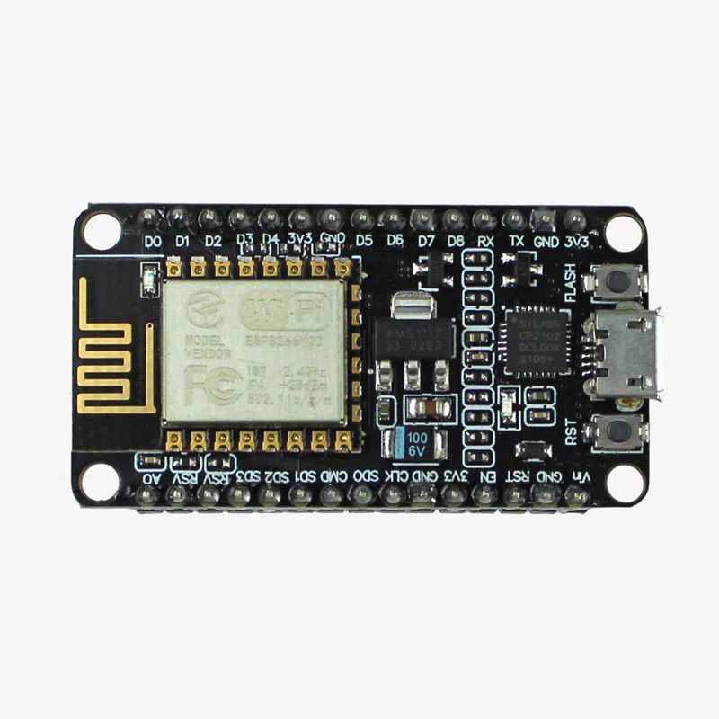
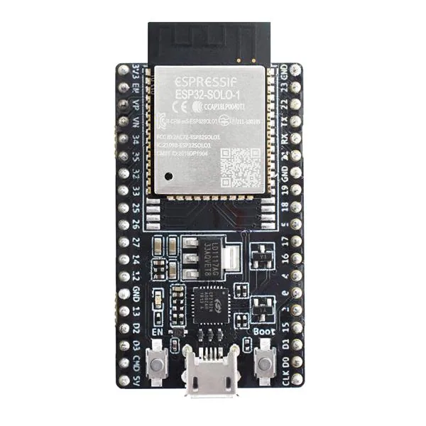

#### Objective

The objective of this experiment is to simulate and analyze the process of acquiring real-time sensor data and transmitting it to a cloud-based IoT platform using **HTTP communication protocols** with **ESP8266 and ESP32** microcontrollers.

This experiment aims to help learners understand **IoT communication flow**, **web-based data transmission**, **client–server interaction**, and **remote monitoring concepts** in a virtual laboratory environment.

#### Introduction

The Internet of Things (IoT) refers to a network of physical devices embedded with sensors, software, and communication technologies that enable them to collect, process, and exchange data over the internet without human intervention.

IoT systems are widely deployed in modern applications such as **smart homes**, **smart agriculture**, **healthcare monitoring**, **industrial automation**, and **environmental sensing**. A typical IoT system integrates hardware, networking, and cloud services to provide real-time data access and intelligent decision making.

A general IoT system consists of the following components:

- **Sensors** for collecting physical or environmental data  
- **Microcontroller** for processing sensor data  
- **Communication module** for transmitting data over the internet  
- **Cloud platform** for data storage, visualization, and analysis  

In this experiment, **ESP8266 and ESP32** microcontrollers are used as IoT-enabled devices to transmit live sensor data to an IoT cloud platform using the **HTTP protocol**, which is one of the most widely used web communication standards.

#### Overview of ESP8266 and ESP32

##### ESP8266

ESP8266 is a low-cost Wi-Fi-enabled microcontroller designed specifically for IoT applications. It integrates networking capabilities directly on the chip, allowing it to connect to Wi-Fi networks without external modules.

Key features of ESP8266 include:
- Integrated TCP/IP protocol stack  
- Built-in Wi-Fi module  
- GPIO pins for sensor interfacing  
- Low power consumption  
- Compact and cost-effective design  

  
*Source: Espressif Systems Documentation*

##### ESP32

ESP32 is a more advanced and powerful successor to ESP8266. It supports both Wi-Fi and Bluetooth connectivity and is suitable for complex IoT applications.

Key features of ESP32 include:
- Dual-core processor  
- Built-in Wi-Fi and Bluetooth  
- Higher processing speed  
- More GPIO pins and peripherals  
- Enhanced security features  

Both ESP8266 and ESP32 can operate as **standalone IoT devices**, directly connecting to the internet and communicating with cloud platforms.

  
*Source: Espressif Systems Documentation*

#### Role of ESP8266 / ESP32 in IoT Communication

In an IoT system, ESP8266 and ESP32 perform multiple critical functions:

1. **Sensor Data Acquisition**  
   The microcontroller reads data from connected sensors using analog or digital pins.

2. **Data Processing and Formatting**  
   Raw sensor values are processed and converted into meaningful units such as temperature (°C), humidity (%), or gas concentration (PPM).

3. **Wi-Fi Connectivity**  
   The ESP connects to a local Wi-Fi network using stored credentials.

4. **HTTP Communication**  
   Sensor data is transmitted to a cloud server using HTTP requests.

5. **Server Response Handling**  
   The ESP receives acknowledgment or status responses from the server.

Thus, ESP8266 / ESP32 act as a **bridge between the physical world and the digital cloud infrastructure**.

#### IoT System Architecture

The general IoT architecture used in this experiment follows a layered approach:

- **Sensing Layer**  
  Sensors measure real-world parameters such as temperature, humidity, gas concentration, or distance.

- **Processing Layer**  
  ESP8266 / ESP32 processes sensor readings and prepares data for transmission.

- **Network Layer**  
  Wi-Fi network provides internet connectivity for data transmission.

- **Application Layer**  
  IoT cloud platform stores, visualizes, and analyzes the received data.

  
*Source: IoT Reference Architecture*

#### Sensor Data Acquisition Process

Sensor data acquisition is a crucial step in IoT systems. The ESP microcontroller performs the following operations:

- Reads **analog sensor values** using ADC pins  
- Reads **digital sensor states** via GPIO pins  
- Converts raw ADC values into physical units  
- Filters or validates data before transmission  

Examples of converted sensor data include:
- Temperature in degrees Celsius (°C)  
- Humidity in percentage (%)  
- Gas concentration in PPM  
- Distance in centimeters (cm)  

Accurate data acquisition ensures reliability of cloud-based monitoring systems.

#### HTTP Protocol Fundamentals

HTTP (Hypertext Transfer Protocol) is a **request–response communication protocol** used between a client and a server. It forms the foundation of web communication and REST-based APIs.

##### Client–Server Model

- **ESP8266 / ESP32** acts as an **HTTP client**  
- **IoT Cloud Platform** acts as an **HTTP server**

##### Common HTTP Methods

- **GET** – Sends data as URL parameters  
- **POST** – Sends data securely in the request body  

HTTP is widely used in IoT applications because:
- It is simple and easy to implement  
- It is compatible with web technologies  
- It works with RESTful APIs  

#### HTTP Data Transmission Mechanism

The steps involved in HTTP-based IoT data transmission are:

1. ESP connects to a Wi-Fi network  
2. Sensor values are read and processed  
3. HTTP request URL or request body is formed  
4. HTTP request is sent to the server  
5. Server processes the request and stores data  
6. Server sends a response to ESP  

A successful HTTP request returns a response such as:

- **200 OK** – Data received successfully  

This confirms successful data transmission.

#### IoT Cloud Platform

An IoT cloud platform provides services for:

- Data storage  
- Data visualization  
- Analytics and alert generation  

Typical features of IoT cloud platforms include:
- Real-time data graphs  
- Historical data logs  
- API keys for authentication  
- Remote data access  

Commonly used IoT platforms include:
- ThingSpeak  
- Firebase  
- Blynk  
- Custom REST-based servers  

  
*Source: IoT Platform Documentation*

#### Data Visualization and Remote Monitoring

Once sensor data reaches the cloud platform:

- Data is stored in cloud databases  
- Values are visualized using graphs and charts  
- Users can monitor data remotely via web or mobile applications  

This enables **real-time monitoring**, **trend analysis**, and **decision making** without physical presence near the sensors.

#### Security Considerations in HTTP-Based IoT Communication

Although HTTP is simple and widely used, it has certain security limitations:

- Data may be transmitted in plain text  
- Vulnerable to data interception  

To enhance security, advanced IoT systems use:
- **HTTPS** for encrypted communication  
- **API keys** for authentication  
- **Authorization tokens**  

This experiment introduces basic HTTP communication concepts, while advanced security mechanisms are explored in higher-level IoT studies.

#### Applications of HTTP-Based IoT Systems

HTTP-based IoT communication is widely used in:

- Smart agriculture monitoring systems  
- Weather stations  
- Remote health monitoring  
- Smart city infrastructure  
- Industrial automation systems  

#### Conclusion

This experiment provides a comprehensive understanding of real-time sensor data acquisition and HTTP-based data transmission using ESP8266 and ESP32 microcontrollers. It introduces core IoT concepts such as cloud connectivity, client–server communication, and remote monitoring, forming a strong foundation for advanced IoT application development.

#### References

1. Arduino and ESP Documentation – https://www.arduino.cc  
2. Espressif Systems ESP8266 & ESP32 Technical Reference  
3. HTTP Protocol Specification – RFC 2616  
4. ThingsBoard IoT Platform Documentation  
5. Internet of Things: A Hands-on Approach – Arshdeep Bahga  

